# Data-Science-Algorithms
This repository contains various Machine Learning, Computational Statistics, and AI algorithms from an Algorithms for Data Science course in my graduate program. Several algorithm files in the data_processing, machine_learning, and game theory directories demonstrate custom implementations in Python. The Jupyter notebooks include applications of these algorithms on simple test datasets. Note: The Principal Component Analysis Algorithm and the Feed Forward Neural Network used built-ins from sklearn and keras. The algorithm summaries below include information from lecture notes in my graduate program. 

## Requirements
- pandas
- numpy
- scipy
- tensorflow
- matplotlib.pyplot
- sklearn (PCA)

## Algorithm Summaries

### Mahalanobis Distance

The Mahalanobis distance measures the distances between a point and a distribution. This algorithm can be used for outlier detection and clustering. This repository applies the Mahalanobis distance for outlier detection. The equation below calculates the Mahalnobis distance for each class observation using the class mean by feature and the class inverse covariance matrix (Johns Hopkins, 2022). 

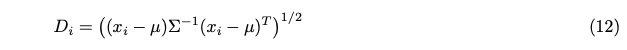

### Bhattacharyya Distance

The Bhattacharyya distance measures class separability. This repository applies to Bhattacharyya distance for feature ranking. The equations below represent the two-class and multiclass cases of the Bhattacharrya distance algorithm.

Two Class:

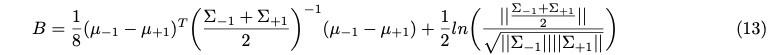

"where | ̇| denotes the determinant of the respective matrix. The Bhattacharyya distance corresponds to the optimum Chernoff bound when Σ−1 = Σ+1. It is readily seen that, in this case, the Bhattacharya distance becomes proportional to the Mahalanobis distance between the means. It should be noted that the Bhattacharya distance consists of two terms. The first term gives the class separability due to the mean difference and disappears when μ−1 = μ+1. The second term gives the class separability due to the covariance difference and disappears when Σ−1 = Σ+1" (Fukunaga, 1990).

Multiclass:

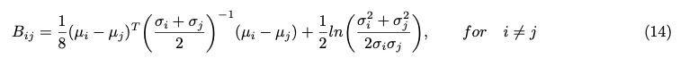

"where i,j ∈ Z in this case corresponding to the classes C = Cj = [C1,C2,...,Cc],j = 1,2,...,c. In this case, for each feature, an individual class is compared to the remaining classes based on distance. The features are assigned a ranking value according to the greatest distance between classes" (Johns Hopkins, 2022).

### Fisher's Linear Discriminant Ratio

Fisher's Linear Discriminant Ratio quantifies the separability capabilities of individual features (Fisher, 1936). FDR can be applied to the two-class case and the multiclass case (one vs. all).

Two Class:

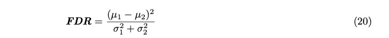

Multiclass: There are varying forms for the multiclass case. The features can be compared individually for all features or by using the one vs. rest approach. 

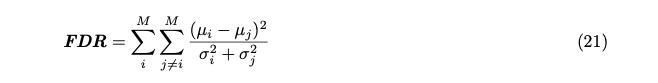

OR

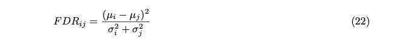

### Expectation Maximization

The Expectation-Maximization (EM) algorithm is an iterative optimization technique used to estimate the parameters of statistical models with missing or incomplete data. The EM algorithm is useful in situations where the data contains latent or unobserved variables which affect the estimation of model parameters. The EM algorithm iteratively estimates the data parameters, using these values to update the estimated parameters (mean, standard deviation, and mixing probabilities) until a desired convergence is met (Johns Hopkins, 2022). The algorithm consists of an expectation step and a maximization step.

- Expectation: The expectation step calculates the membership probabilities P(k|n) (Tomasi, 2006). The mixing probabilities are viewed as the sample mean of the membership probabilities assuming a uniform distribution over all data points.

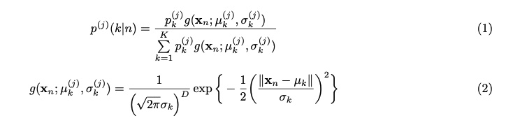

"Note that ∥xn − μk∥ is the vector norm in which the distance between the observation vector and the cluster mean vector is calculated. To account for the individual values of the vectors xn and μk the vectors are temporarily written as xnd and μkd in the following equation to account for the dimension of the vectors" (Johns Hopkins, 2022).

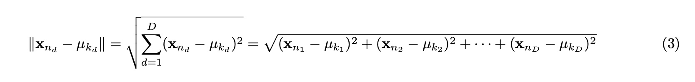

- Maximization: The Maximization step uses the data from the expectation step as if it were measured data to determine the maximum likelihood estimate of the parameter (Tomasi, 2006). The EM algorithm consists of iterating the mean, standard deviation, and mixing probabilities until convergence.

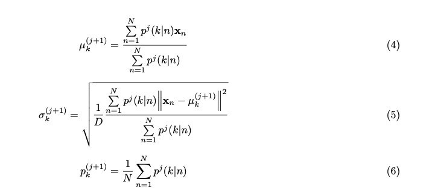

### Discrete Cosine Transform

The Discrete Cosine Transform (DCT) is widely used in signal and image processing. DCT is particularly effective for compressing and analyzing signals or images because it concentrates most of the signal energy into a few coefficients. The algorithm converts a finite sequence of data points, typically in the spatial or time domain, into a representation in the frequency domain. The DCT transform is used in JPEG compression. The DCT implementation in this repository applies the DCT2 equation shown below.

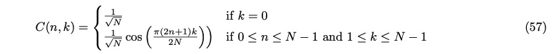

"This equation provides an N × N matrix that can be used to transform an N × N input matrix. The transform is performed on the two-dimensional matrix Im as CImCT" (Johns Hopkins, 2022). In the case when matrix multiplication is not used, the following equation can be used to take the two-dimensional discrete cosine transform of the matrix Im (Johns Hopkins, 2022).

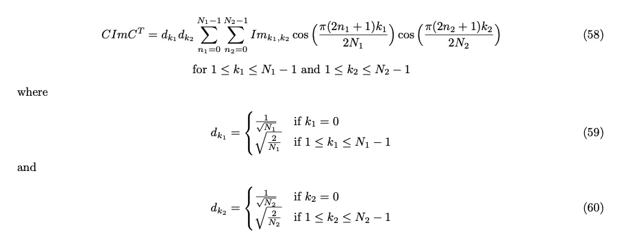

The transform helps to remove data redundancy by mapping data from a spatial domain to the discrete cosine domain. Note: no compression is applied by the above equations. The equations transform the data into a format that simplifies data compression. 

### Eigen Decomposition

Eigen Decomposition transforms a sqaure matrix into a set of eigenvalues and eigenvectors. Eigen Decomposition can be used for feature generation and dimensionality reduction. For dimensionality reduction, "using a transformation f(x) that maps the data points x of the input space, x[n], into a reduced dimensional space x′[p], where n > p, creates features in a new space that may have better discriminatory properties" (Johns Hopkins, 2022). The number of features selected to retain is significant when applying eigen decomposition. If the transformation chosen is too complex, the ability to generalize from a small data set will be poor. If the transformation chosen is too simple, it may constrain the decision boundaries to a form that cannot discriminate between classes (Johns Hopkins, 2022). Eigen decomposition is also used with Principal Component Analysis and the Karhunen-Lo'eve Transform for feature generation. The formula for eigen decomposition is below.

"Let A be a square n × n matrix with n linearly independent eigenvectors qi (where i = 1, ..., n). Then A can be factorized as

    A = Q Λ inv(Q) 

where Q is the square n × n matrix whose ith column is the eigenvector qi of A, and Λ is the diagonal matrix whose diagonal elements are the corresponding eigenvalues" (Wikipedia, n.d.)

### K-fold Validation

K-fold validation is a sampling technique that is beneficial for small datasets. K-fold validation generates k folds (samples) of the dataset comprised of a training and test set or a training, validation, and test set. The model is then trained on each fold and evaluated using the average accuracy of the k experiments. 

### Bayes Classifier

The Bayes classifier is a probabilistic machine learning algorithm that is commonly used for classification tasks. The algorithm is based on Bayes' theorem and assumes that the features are conditionally independent. Bayes Classifier is a simple and efficient algorithm for handling high-dimensional datasets. This classification approach is useful when the conditional independence assumption holds or when there is limited training data available. The Bayesian classifier may struggle with datasets that have correlated features or when interactions among features are important. Some real-world scenarios where Bayes Classifiers excel are text classification, spam filtering, and sentiment analysis.

"The Bayes classifier can be expressed in terms of the prior probabilities, P(Ci), and posterior probability of
class membership as follows:

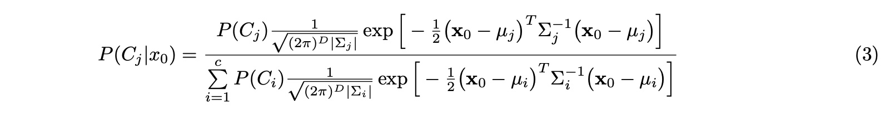

where the a priori probabilities P(Cj) are the estimates belonging to a class under the assumption that Σj = Σ for ∀j. The classification decision assigns the input observation x0 to the class Cj with maximal posterior probability according to the inequality by a largest value returned to Cj,0. Consider a two-class case where the classes are C1 and C2 as follows:

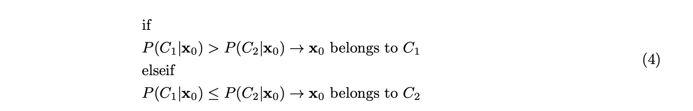

This example can be extended to the multiclass case" (Johns Hopkins, 2022). 

### Parzen Windows

Parzen Window estimation applies the idea that the knowledge gained by each training observation of the input space is represented by a function in the feature space. The functions are represented using a distance measure or kernel estimator (Johns Hopkins, 2022). Summing the results of the kernel functions for each training observation determines the class estimation (Johns Hopkins, 2022).

An optimized model used in this repository is the Parzen window density model. The parzen window density model uses a Gaussian window surrounding each input data point to maximize the likelihood of the training data. "The Gaussian window can be represented with the use of a kernel function as an interpolation function which defines an inner product between the individual training observations. The Radial Basis kernel function uses a window width parameter,h, which is also known as the spread of the function. The Parzen Window estimation is given as follows:

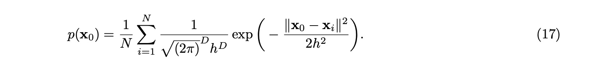

where h ∈ R+ represents the size of the hypercube hD in D dimensions" (Johns Hopkins, 2022).

Next, the classification decision applies the following inequality to "assign the observation x0 to the class with maximal posterior probability:" (Johns Hopkins, 2022).

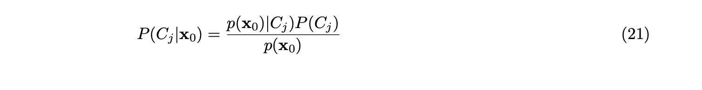

Note: the Parzen Window approach is computationally expensive, and the number of training examples must be small. 

### Radial Basis Function Neural Network

"The radial basis function (RBF) neural network is a type of feedforward neural network that differs from a multilayer perceptron in the activation function" (Johns Hopkins, 2022). The RBF neural network is known for its ability to approximate complex functions and handle nonlinear relationships in data. RBF neural networks are commonly used for function approximation, pattern recognition, and classification tasks. Unlike other neural networks, RBF neural networks consist of only one hidden layer, making them computationally efficient to train. Neural networks that apply activation functions in their hidden layers often suffer from underfitting when using only one hidden layer. RBF neural networks transform data into higher dimensional space in the hidden layer instead of applying interior activation functions (Ramadhan, 2021). This technique offsets the network's architectural simplicity.  

### MiniMax/Alpha-BetaPruning Algorithms 

The minimax algorithm is a decision-making strategy commonly used in two-player games with perfect information, such as chess or tic-tac-toe. The goal of the algorithm is to determine the best possible move for a player, assuming that both players are playing optimally. See the algorithm pseudocode below.

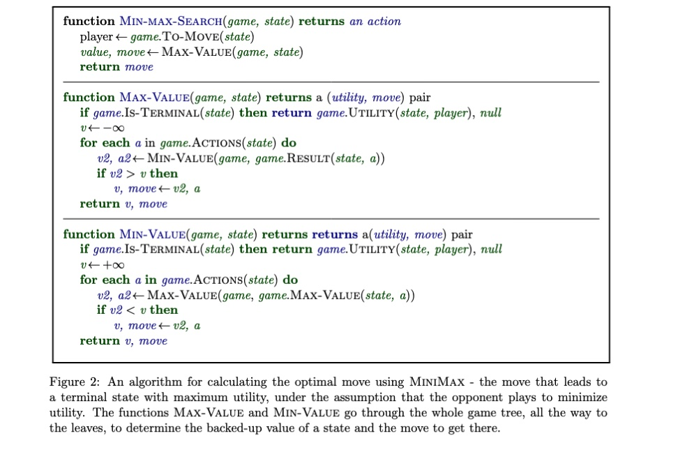

It's worth noting that the minimax algorithm assumes perfect play from both players, which may not always be the case in real-world scenarios. Additionally, to improve its efficiency, the algorithm often incorporates various optimizations, such as alpha-beta pruning, to avoid evaluating unnecessary branches of the game tree. See the pseudocode below for the alpha-beta-pruning algorithm. 

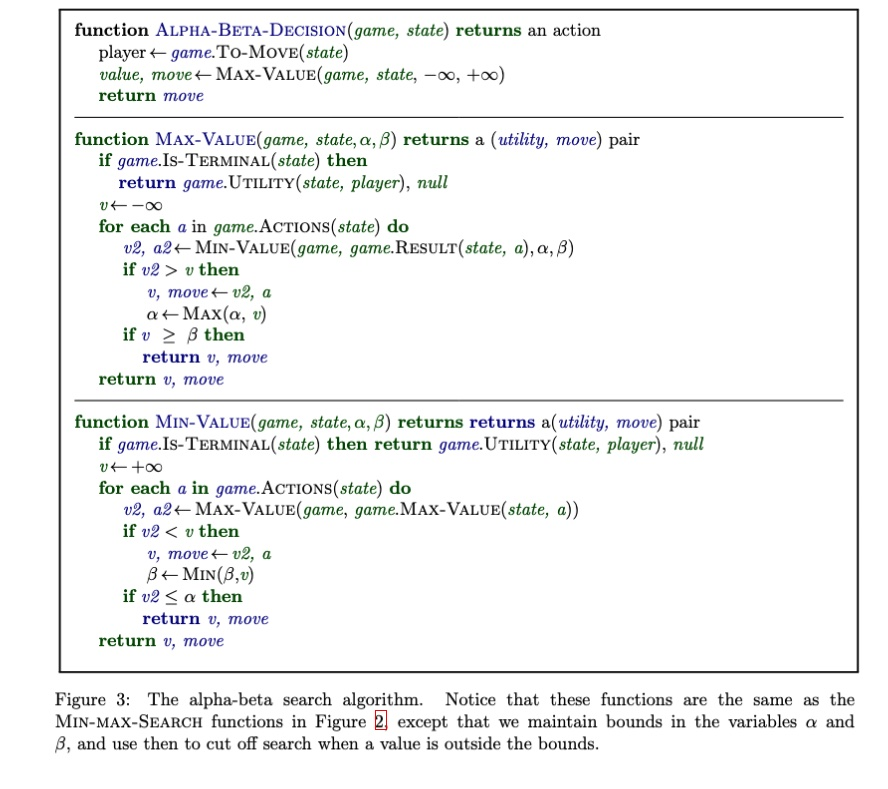

## Project Files

- Spence_PA1: This file demonstrates data manipulation for analysis, data normalization, outlier removal, feature ranking, principal component analysis, and game theory. This file includes samples of the following algorithms:
    - Mahalanobis Distance (outlier removal)
    - Bhattacharyya distance (feature ranking)
    - Fischer's Linear Discriminant Ratio (feature ranking)

- Spence_PA2: This file demonstrates Expectation Maximization, Bayes Classifier, Feed Forward Neural Networks, Parzen Window, and the MiniMax Algorithm applied to TicTacToe. This file includes samples of the following algorithms:
    - Expectation Maximization (ML: clustering)
    - Bayes Classifier (ML: classification)
    - Feed Forward Neural Network (ML: classification)
    - K-Fold Validation (ML: sampling)
    - Parzen Windows (ML: Classification)
    - MiniMax Algorithm (Game Theory)

- Spence_HW2: This file demonstrates data analysis, outlier removal, data transformations, and dimensionality reduction. This file includes samples of the following algorithms:
    - Mahalanobis Distance (outlier removal)
    - Discrete Cosine Transform (data transformation)
    - Eigen Decomposition (dimensionality reduction)
    
- Spence_HW3: This file demonstrates feature ranking, k-fold validation, and the parzen window algorithm for classification and plotting kernels. This file includes samples of the following algorithms:
    - Fischer's Discriminant Ratio (feature ranking)
    - K-Fold Validation (sampling)
    - Parzen Windows (ML: classification)
    
 - Spence_HW4: This file includes a custom implementation of a Radial Basic Function Neural network and a manual walkthrough of the MiniMax algorithm used in Spence_PA2.ipynb. This file includes samples of the following algorithms:
    - Radial Basis Function Neural Network (classification)
    - MiniMax Algorithm (game theory)
    
### TODO:
- Add unit/regression tests

## References

Fisher, R.A. (1936) The Use of Multiple Measurements in Taxonomic Problems. Annals of Eugenics, 7, 179-188.
http://dx.doi.org/10.1111/j.1469-1809.1936.tb02137.x 

Fukunaga, K. (1990) Introduction to Statistical Pattern Recognition. 2nd Edition, Academic Press, Boston.

Johns Hopkins. (October, 2022). Computational Statistics Lecture PDF. Whiting School of Engineering.

Johns Hopkins. (October, 2022). Machine Learning Lecture PDF. Whiting School of Engineering.

Johns Hopkins. (September, 2022). Data Processing Lecture PDF. Whiting School of Engineering.

Johns Hopkins. (September, 2022). Data Transformation Lecture PDF. Whiting School of Engineering.

Ramadhan, L. (2021). Radial Basis Function Neural Network Simplified. TowardsDataScience.com. https://towardsdatascience.com/radial-basis-function-neural-network-simplified-6f26e3d5e04d

Tomasi, C. (2006). Estimating Gaussian Mixture Densities with EM – A Tutorial. Duke University Course Notes http://www.cs.duke.edu/courses/spring04/cps196.1/handouts/EM/tomasiEM.pdf. Retrieved Sept 2006

Wikipedia, n.d., Eigen Decomposition of a Matrix. https://en.wikipedia.org/wiki/Eigendecomposition_of_a_matrix. Retrieved May, 2023.

